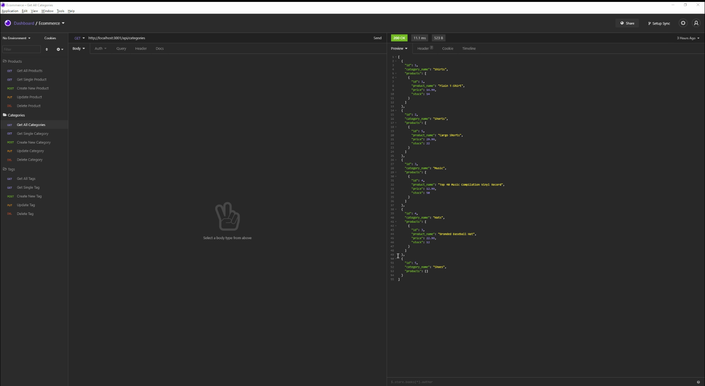

# Ecommerce-back-end  

## Description
Creating an application from starter code to create the back end functionality of an ecommerce app.  By creating the models, associations, and routes for various requests to the database, such as retriving data, creating data, updating and deleting data.  Whilst there was no front end code, it's functionality can be seen by testing in insomnia.

## Table of Contents
  - [Ecommerce Back End](#Ecommerce-back-end)
  - [Description](#description)
  - [Table of Contents](#table-of-contents)
  - [Installation](#installation)
  - [Usage](#usage)
  - [License](#license)
  - [Contributors](#contributors)
  - [Technologies Used](#technologies-used)
  - [Future versions](#future-versions)

## Installation
Initiate the app by opening the terminal, and running npm install, copy the code from schema.sql and paste into mySQL Workbench, run the code there.  Return to VSCode terminal and run "npm run seed", followed by "npm start".  

## Usage
Run various URL's in Insomnia to query and manipulate the database

A screenshot 

Video of the application in use:

[video link](https://drive.google.com/file/d/17YFknC8Vhuu_MljkEA4Gb3PQ7nRmXrfQ/view?usp=sharing)

## License
License with MIT

## Contributors
This app is the sole work of [Claire Davies](https://github.com/ClaireMDavies)

## Technologies Used
- Javascript
- node.js
- sequelize npm
- mySQL2 npm
- dotenv
- express npm
- mySQL Workbench
- insomnia
    

## Future versions
Whilst creating the functionality that was required for this project, I would like to take this further, and create a more robust application.  Such as:

- better manipulation of the data so that superfluous data was not returned
- making the category_id not null, so that id was necessary
- Looking at how to condense the code around foreign keys, whilst still making it robust, as the way we were told to do it, seemed to be repetitious.  
 
  